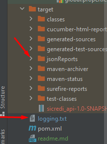
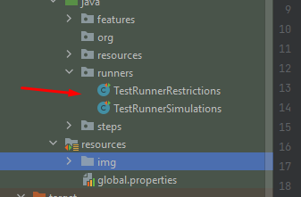
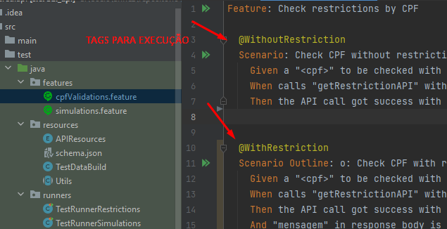
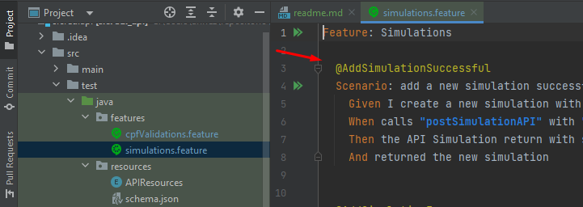
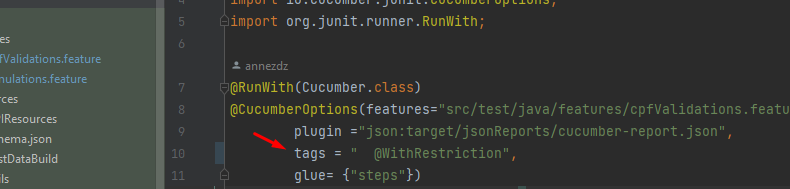
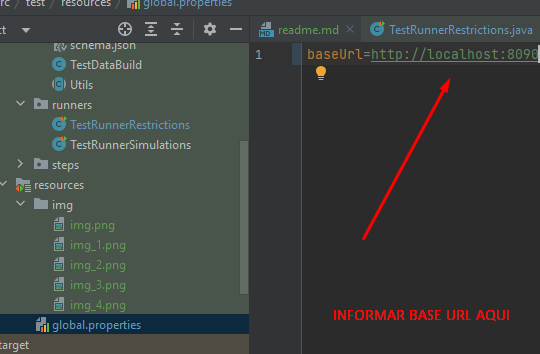

# Prova técnica API

##  Tecnologias

 * Java 11
 * Maven
 * Rest Assured 4.1.2
 * JUnit 
 * Cucumber 4.8.0 
 * JSON Schema Validator 4.3.3
 * Javafaker 1.0.2

## Execução

Para execução do projeto é necessário cloná-lo e executar em sua IDE favorita.

# Pontos importantes

Relatórios das execução localizados aqui.

Runners para execução dos cenários

Arquivos Cucumber com os cenários

)

Tags para execução dos cenários de Restrição

Tags para execução dos cenários de Simulações

Informar a tag na Runner

Informar a base URL aqui 

# Execuções conflitantes com a documentação disponibilizada.

Diversos cenários tiveram retorno que não estão de acordo com a documentação 
disponibilizada para realização do desafio, tanto com relação ao status code retornado
quanto pela mensagem retornada.

Nesses casos segui com o que estava descrito na documentação e ao executar esses cenários
os mesmos falharão.

Seguem os cenários acima mencionados com a evidência da documentação x execução realizada.
(OBS: testes realizados no Postman tivemos o mesmo retorno)

* Documentação : 
  

* Execução : 

