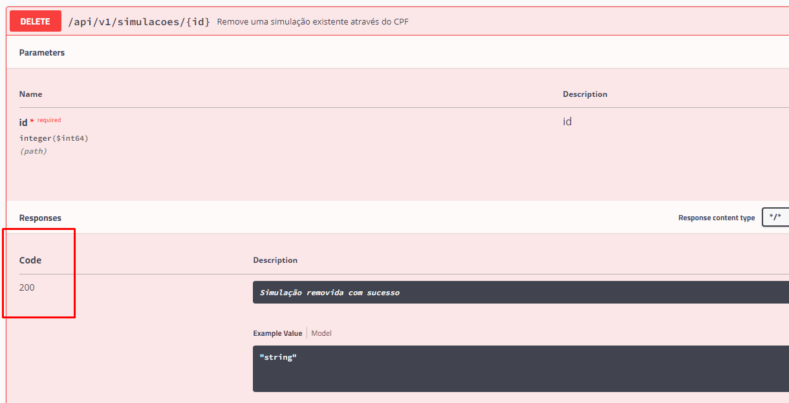

# Prova técnica API

##  Tecnologias

 * Java 11
 * Maven
 * Rest Assured 4.1.2
 * JUnit 
 * Cucumber 4.8.0 
 * JSON Schema Validator 4.3.3
 * Javafaker 1.0.2

## Execução

Para execução do projeto é necessário cloná-lo e executar em sua IDE favorita.

# Pontos importantes

Relatórios das execução localizados aqui.

Runners para execução dos cenários

Arquivos Cucumber com os cenários

Tags para execução dos cenários de Restrição

Tags para execução dos cenários de Simulações

Informar a tag na Runner

Informar a base URL aqui 

# Execuções conflitantes com a documentação disponibilizada.

Diversos cenários tiveram retorno que não estão de acordo com a documentação 
disponibilizada para realização do desafio, tanto com relação ao status code retornado
quanto pela mensagem retornada.

Nesses casos segui com o que estava descrito na documentação e ao executar esses cenários
os mesmos falharão.

Seguem os cenários acima mencionados com a evidência da documentação x execução realizada.
(OBS: testes realizados no Postman tivemos o mesmo retorno)

# Execucoes com falha / defeito

## Cenarios de Restricao

### CN - @WithRestriction

 * Retorno divergente (mensagem)

* Criterio de aceite 
* 

* Execução : 

*  Retorno divergente com criterio de aceite.

## Cenarios de Simulacao

### CN - @AddSimulationExistent

* Retorno da mensagem e status code divergente com documentacao.

* Criterio de aceite

* Execução : 

### CN - "@PutWithoutSimulation

* Criterio de aceite divergente no PDF disponibilizado e na documentacao da API.

 * Divergencias : Mensagem de retorno divergente nas documentacoes.

* Execucao: 

* Como foram retornados o status code correto e a mensagem coerente, a priori considerei o teste como PASSED.

### CN - "@DeleteSimulationSuccessful"

* Criterio de aceite divergente no PDF disponibilizado e na documentacao da API.
Status Code de acordo com PDF deve ser 204 , mas na documentacao informa que deve ser 200.
* 
* Criterio de aceite:

* Execucao: 

* Retorno correto de acordo com documentacao da API. 
Nesse caso o CN esta com status PASSED.

### CN - @TryDeleteSimulation

* Status code incorreto e nao e exibida a mensagem de retorno.
#### Qualquer ID informado nao existente esta retornando 200 e a mensagem OK

* Criterios de aceite

* Na documentacao da API nao esta descrito esse comportamento, apenas no PDF.
* Nesse caso considero o CN FAILED.
* 

* Execucao : CN FAILED 

### CN - @TryGetAllSimulations

* Ao tentar buscar todas as simulacoes, quando nao existe simulacao cadastrada retorna status 200.

* Criterios de aceite

* Execucao : CN FAILED 
* Na documentacao da API nao esta previsto esse comportament, apenas no PDF disponibilizado.
Nesse caso considero o CN FAILED ao retornar um status code diferente do criterio de aceite.

# IMPORTANTE 

## Simulacoes

## Restricoes

